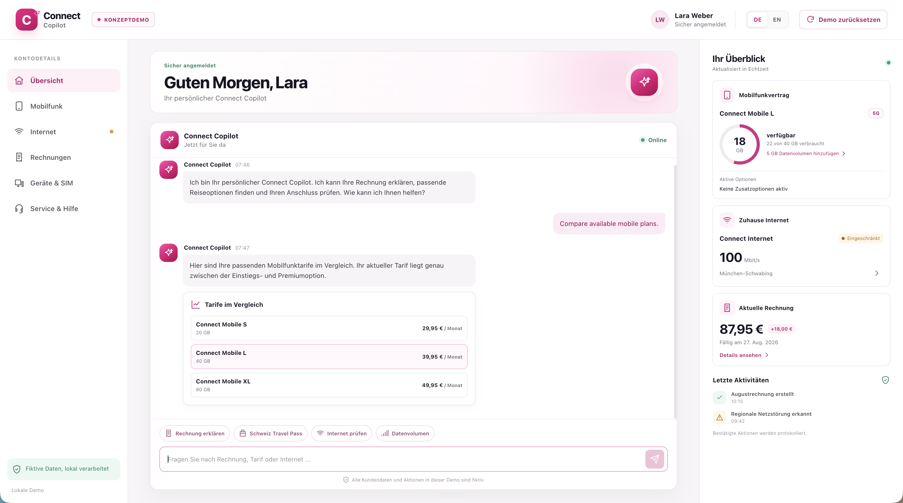

# Connect Copilot

A bilingual, local-first telecom customer-service and incident-response demonstration. The project combines a React customer dashboard, a deterministic service assistant, fictional mobile and home-internet accounts, confirmation-gated account actions, visible audit events, and a separate incident command center for a parallel Codex worktree exercise.



All customer identities, billing records, contracts, network conditions, and carrier actions are fictional. The application does not connect to real telecommunications systems.

## Demo experiences

| Experience | Local URL | Purpose |
| --- | --- | --- |
| Customer dashboard | [http://127.0.0.1:4175](http://127.0.0.1:4175) | Demonstrate bilingual support, billing explanations, service diagnostics, and explicitly confirmed account changes. |
| Incident command center | [http://127.0.0.1:4175/demo/incidents/8239](http://127.0.0.1:4175/demo/incidents/8239) | Investigate fictional P1 incident `INC-8239` and verify an isolated customer-dashboard display fix. |

## Requirements

- Node.js 20 or newer.
- npm, included with Node.js.

No Docker, database, carrier integration, cloud service, or OpenAI API key is required.

## Start the demo

```bash
npm ci
npm start
```

Open [http://127.0.0.1:4175](http://127.0.0.1:4175).

One Node.js process serves both React experiences and all backend routes. The development server uses Vite middleware and binds to `127.0.0.1:4175` by default.

To confirm the server is ready:

```bash
curl -fsS http://127.0.0.1:4175/api/health
```

To use a different local port:

```bash
PORT=4180 npm start
```

The second port lets a Codex worktree run alongside the original checkout. Its customer dashboard and incident command center are available at `http://127.0.0.1:4180` and `http://127.0.0.1:4180/demo/incidents/8239`.

## Codex environment and quick actions

The shared Codex configuration in `.codex/environments/environment.toml` installs dependencies with `npm ci` when a managed environment or worktree is prepared.

| Codex action | Command | Purpose |
| --- | --- | --- |
| Run demo | `npm start` | Start the main demo on port 4175. |
| Run worktree demo | `PORT=4180 npm start` | Start an isolated checkout on port 4180. |
| Run tests | `npm test` | Run the complete Node.js test suite. |
| Build frontend | `npm run build` | Create the production frontend in `dist/`. |

`npm run dev` is also available and currently runs the same server as `npm start`.

## Seeded fictional customer scenario

- **Customer:** Lara Weber in Munich.
- **Mobile plan:** Connect Mobile L with 40 GB included, 22 GB used, and 18 GB remaining.
- **Current bill:** EUR 87.95 compared with the previous EUR 69.95 bill.
- **Bill difference:** EUR 18.00 in Switzerland data-roaming charges.
- **Switzerland Travel Pass:** EUR 9.95 for seven days and 3 GB.
- **Home internet:** 100 Mbit/s advertised, 12 Mbit/s actually measured, and a simulated local outage in Munich-Schwabing.
- **Estimated service restoration:** 16:30.

The travel pass applies to future covered usage. Activating it does not remove or refund the existing EUR 18 roaming charge.

## Recommended executive walkthrough

1. Choose **DE** or **EN** in the application header.
2. Ask why the current bill is EUR 18 higher. The assistant explains the fictional Switzerland roaming charge and shows the full bill breakdown.
3. Select the suggested Switzerland travel pass. Review its 7-day duration, 3 GB allowance, and EUR 9.95 price.
4. Explicitly confirm activation. The active add-on and audit feed update immediately.
5. Ask about slow home internet. The assistant identifies a simulated local outage in Munich-Schwabing and displays the expected restoration time.
6. Request a restoration notification and confirm it. The home-internet account card and activity feed update immediately.
7. Select **Reset demo** to restore the original fictional account.

Additional supported journeys:

- Check remaining mobile data.
- Add a 5 GB data boost after explicit confirmation.
- Review the current contract and compare available plans.
- Inspect devices and masked SIM information.
- Report a lost phone and temporarily block its SIM after confirmation.
- Ask for router troubleshooting.
- Request a simulated handoff to a human support specialist.
- Switch between German and English at any time.

## Simulated incident-response demo

Open [http://127.0.0.1:4175/demo/incidents/8239](http://127.0.0.1:4175/demo/incidents/8239) to inspect fictional P1 incident `INC-8239`.

The workshop baseline intentionally contains a presentation defect:

- The fictional connection is degraded and actually measures **12 Mbit/s**.
- The advertised plan maximum is **100 Mbit/s**.
- The customer dashboard incorrectly displays **100 Mbit/s** as the prominent connection speed.
- The incident command center detects the mismatch, reports the incident as **Open**, and calculates an **88%** reduction from the advertised speed.

The command center includes bilingual incident details, customer-facing reproduction steps, engineering evidence, a live incident timeline, a refresh control, and a verification panel. It reads the existing session and account endpoints rather than introducing a separate incident API.

### Incident workshop walkthrough

1. Open the customer dashboard and inspect the degraded home-internet card.
2. Open the incident command center and compare the measured 12 Mbit/s with the displayed 100 Mbit/s.
3. Inspect the shared presentation helper in `src/lib/internet-status.js` and its usage in `src/components/AccountRail.jsx`.
4. Run an isolated worktree on port 4180 while the original demo remains available on port 4175.
5. Update the shared presentation logic so a degraded connection prominently displays its measured speed while retaining the advertised speed as separate plan information.
6. Update the workshop-baseline regression test in `test/incident.test.js` to reflect the corrected behavior, then run the complete test suite.
7. Refresh the incident page in the fixed worktree and confirm that `INC-8239` changes to **Resolved** because the displayed and measured values now match.

Resolving the speed-display incident does not repair the separate fictional network outage. The degraded service state, restoration estimate, bilingual copy, and existing customer-service workflows must remain intact.

## Project structure

```text
server.js                             Local HTTP server, API routes, and Vite integration
server/assistant.js                   Deterministic bilingual support and action proposals
server/actions.js                     Confirmed account mutations and audit events
server/seed-data.js                   Fictional customer, billing, and service state
server/sessions.js                    In-memory customer sessions
server/optional-openai.js             Optional rewriting of informational replies
src/App.jsx                           Customer dashboard
src/components/AccountRail.jsx        Account cards and customer-facing internet speed
src/pages/IncidentPage.jsx            Incident command center
src/lib/internet-status.js            Shared internet-speed display and incident status
src/lib/incident-copy.js              German and English incident-page copy
test/                                 Node.js unit, frontend, API, and incident tests
.codex/environments/environment.toml  Managed Codex setup and quick actions
```

## Tests

```bash
npm test
```

The built-in Node.js test runner verifies bilingual intent recognition, exact bill calculations, travel-pass activation, additional mobile data, SIM blocking, outage notifications, single-use confirmation tokens, token expiration, isolated customer sessions, cross-origin protection, language switching, account reset, API error responses, incident-state derivation, bilingual incident copy, and the intentionally preserved workshop-baseline display defect.

Run only the incident-response tests:

```bash
node --test test/incident.test.js
```

Build the production frontend and serve the generated assets:

```bash
npm run build
npm run serve
```

`npm run serve` requires an existing `dist/` directory, so run `npm run build` first. The customer dashboard and incident route remain available in production mode.

## Optional OpenAI enhancement

The deterministic local assistant supports every demonstration journey without an API key. If you explicitly configure an OpenAI key, informational responses can be rewritten more naturally while backend facts and account-action safeguards remain authoritative:

```bash
OPENAI_API_KEY="your-key" npm start
```

Optionally choose another model:

```bash
OPENAI_API_KEY="your-key" OPENAI_MODEL="gpt-4.1-mini" npm start
```

Missing keys, failed API requests, and timeouts automatically fall back to the local assistant. The key remains on the server and is never exposed to the browser.

Supported environment variables:

| Variable | Default | Purpose |
| --- | --- | --- |
| `PORT` | `4175` | Local HTTP port. |
| `HOST` | `127.0.0.1` | Network bind address. Keep the default for local-only demonstrations. |
| `OPENAI_API_KEY` | Unset | Enables optional rewriting of informational assistant replies. |
| `OPENAI_MODEL` | `gpt-4.1-mini` | Model used when an OpenAI API key is explicitly configured. |

## Security and demo boundaries

- The server binds to `127.0.0.1` by default.
- Simulated sessions use HTTP-only, same-site cookies.
- Account changes require single-use confirmation tokens that expire after five minutes.
- Confirmation tokens are scoped to their simulated customer session.
- Cross-origin browser requests cannot perform account actions.
- All confirmed account changes produce visible audit events.
- Incident status is derived from fictional account data and the shared presentation helper, not a production incident-management system.
- Phone numbers are masked and all customer information is fictional.
- State exists only in memory and resets when the process restarts.
- The interface is a concept demonstration and does not claim official carrier integration, regulatory certification, or production readiness.

## HTTP routes

| Route | Purpose |
| --- | --- |
| `GET /api/health` | Application readiness and assistant mode. |
| `GET /api/session` | Fictional customer session and selected language. |
| `GET /api/account` | Current account, billing, SIM, and service state. |
| `GET /api/activity` | Recorded audit events. |
| `POST /api/chat` | Bilingual deterministic support conversations. |
| `POST /api/actions/confirm` | Explicitly confirm one proposed account action. |
| `POST /api/actions/cancel` | Cancel a pending account action. |
| `POST /api/language` | Switch between `de` and `en`. |
| `POST /api/reset` | Restore all original fictional account data. |
